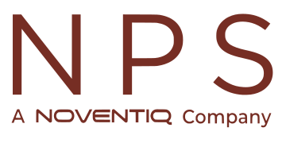

# 🤝 NPS Client Support

Welcome to the **official client support repository** for NPS Business Central extensions.  
Here you’ll find contact links, bug tracking, and project updates for clients using our AppSource solutions.

---

## ✉️ Contact Us

Send us an email:  

Visit our website:  

---

## 🛠️ Suggestions & Bug Tracking

Follow progress or submit issues via GitHub Projects:  

Issue status:
- 
- 

---

## 📌 About This Repo

This repository is dedicated to:
- Tracking client feedback and issues
- Sharing updates and feature requests
- Supporting users of our Business Central extensions

Thank you for choosing NPS!  
Need help or want to report a problem? Just reach out through one of the channels above.
