# Document Printout

## Internal Invoice

Within the Posted Purchase Invoice, you can access the internal calculation, review it, forward, or print the internal calculation. This is facilitated through a request page that offers a selection of multiple options.

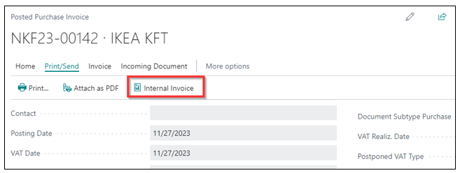

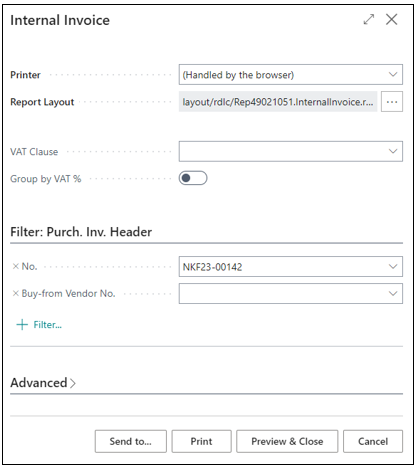

## Purchase Receipt

Within the Posted Purchase Credit Memo, you can review, forward, or print the document. This is facilitated through a request page that offers a selection of multiple options.

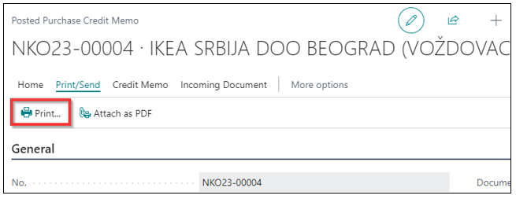

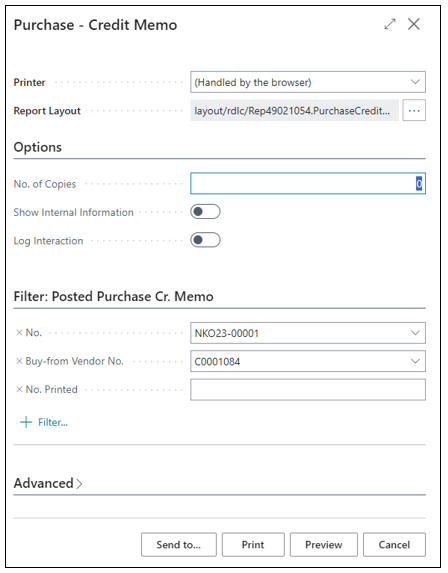

## Purchase Receipt

Within the Posted Purchase Receipt, you can review, forward, or print the document. This is facilitated through a request page that offers a selection of multiple options.

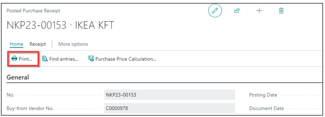

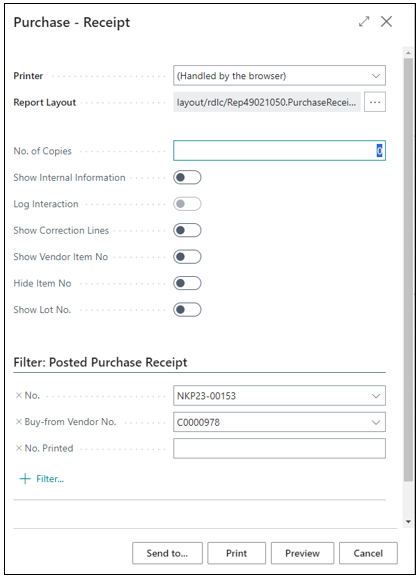

## Sales Quote

When you want to print Sales Quote, you will receive a data entry and configuration page. The page features several options that can be reviewed and printed.

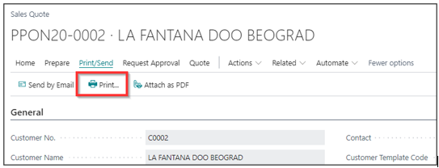

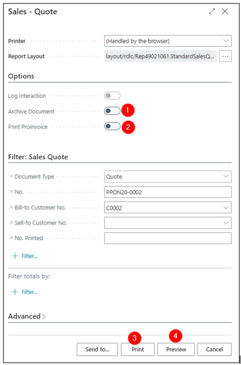

1. Archive Document - To place the document in the Sales Quote Archives, it is necessary to make adjustments on the page Sales & Receivables Setup in the Archiving section.

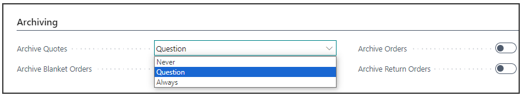

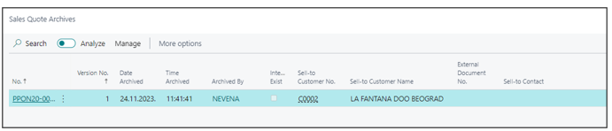

2. Proinvoice will be printed on the document.
3. Print
4. Preview

## Sales Credit Memo

Within the Posted Sales Credit Memo, you can review, forward, or print the document. This is facilitated through a request page that offers a selection of multiple options.

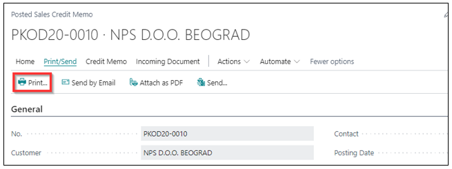

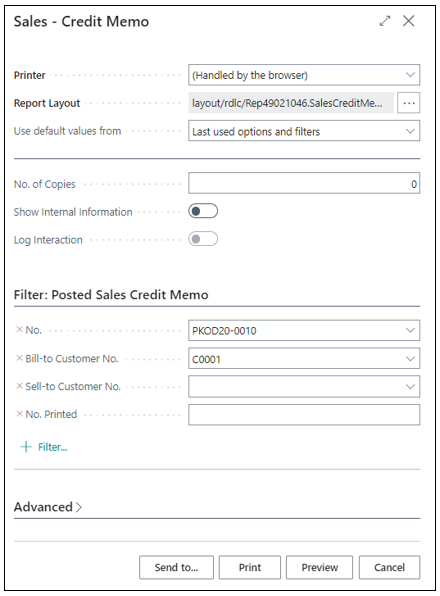

## Sales Invoice

Within the Posted Sales Invoices, you can review, forward, or print the document. This is facilitated through a request page that offers a selection of multiple options.

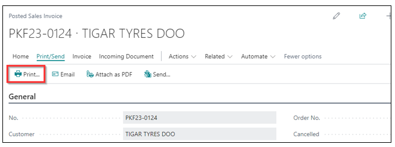

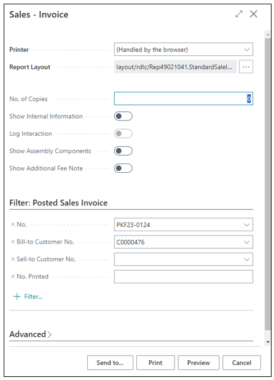

## Sales Shipment

On a Posted Sales Shipment, you can initiate printing with the following options based on your specific needs.

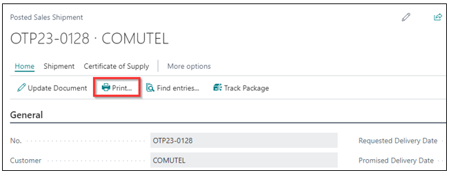

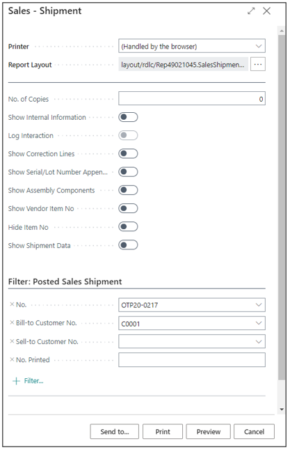

## Sales Pro Forma Invoice

Using the Sales Invoice, you have the option to print a Pro Forma invoice. After creating the Sales Invoices, you can easily generate a Pro Forma invoice directly from the document.

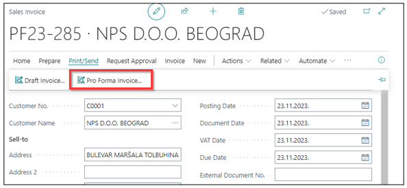

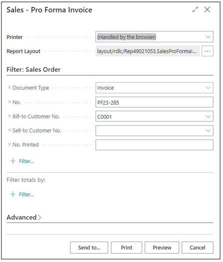

## Service Shipment

## Service Credit Memo

Within the Posted Services Credit Memo, you can review, forward, or print the document. This is facilitated through a request page that offers a selection of multiple options.

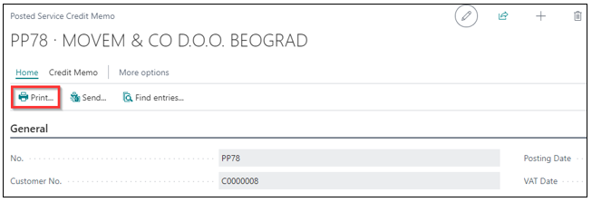

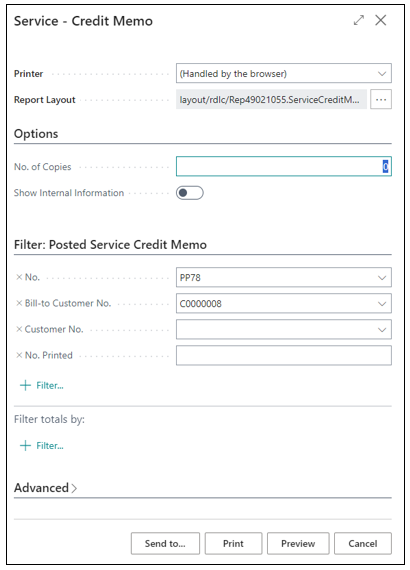

## Service Invoice

Within the Posted Sales Invoices, you can review, forward, or print the document. This is facilitated through a request page that offers a selection of multiple options.

## Warehouse Posted Receipt

Within the Posted Warehouse Receipt, you can review, forward, or print the document. This is facilitated through a request page that offers a selection of multiple options.

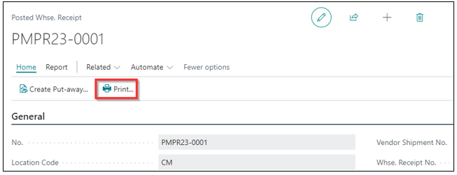

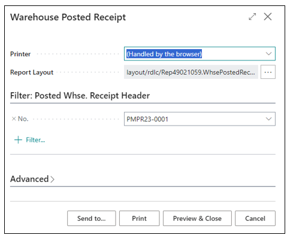

## Warehouse Posted Shipment

Within the Posted Warehouse Shipment, you can review, forward, or print the document. This is facilitated through a request page that offers a selection of multiple options.

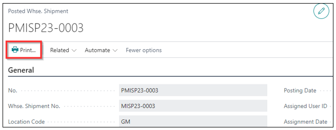

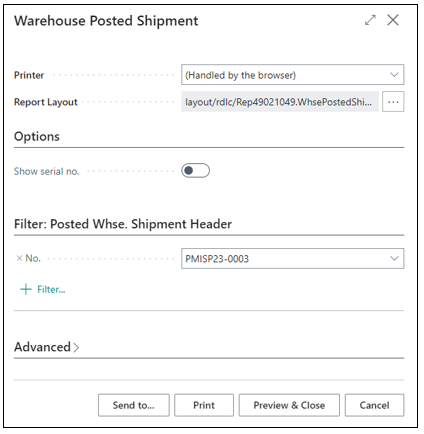
